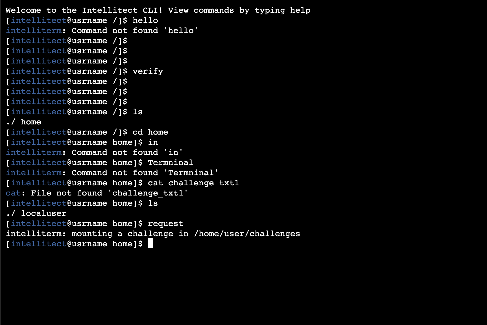

<a name="readme-top"></a>
<div align="center">

[](https://github.com/IntelliTect/IntellitectTerminal/actions/workflows/Build-Test-And-Deploy.yml)
</div>
<!-- PROJECT LOGO -->
<br />
<div align="center">
  <a href="https://console.intellitect.com">
    
  </a>

  <h3 align="center">IntelliTerminal</h3>

  <p align="center">
    An awesome README template to jumpstart your projects!
    <br />
    <br />
    <a href="https://console.intellitect.com">View Console</a>
    ·
    <a href="https://github.com/IntelliTect/IntellitectTerminal/issues">Report Bug/Feature</a>
    ·
    <a href="https://github.com/IntelliTect/IntellitectTerminal/files/9295965/presentation.pptx">Powerpoint Presentation</a>
  </p>
</div>

<!-- TABLE OF CONTENTS -->
<details>
  <summary>Table of Contents</summary>
  <ol>
    <li>
      <a href="#about-the-project">About The Project</a>
      <ul>
        <li><a href="#built-with">Built With</a></li>
      </ul>
    </li>
    <li>
      <a href="#getting-started">Getting Started</a>
      <ul>
        <li><a href="#prerequisites">Prerequisites</a></li>
        <li><a href="#installation">Installation</a></li>
      </ul>
    </li>
    <li><a href="#license">License</a></li>
  </ol>
</details>

<!-- ABOUT THE PROJECT -->
## About The Project

[](https://console.intellitect.com)

Of course, no one terminal will serve all your need since your needs may be different. But give it a try.

<p align="right">(<a href="#readme-top">back to top</a>)</p>

### Built With

* Vue.js with typescript
* Asp.net
* [Coalesce](https://github.com/IntelliTect/Coalesce)
* [XTerm.js](https://xtermjs.org/)

<p align="right">(<a href="#readme-top">back to top</a>)</p>

<!-- GETTING STARTED -->
## Getting Started

### Prerequisites

To run this locally, you will need

* node/npm
* dotnet
* Visual Studio (optional)
* Sql server

### Installation

1. Clone the repo
   ```sh
   git clone https://github.com/IntelliTect/IntellitectTerminal.git
   ```
2. Cd into Web
   ```sh
   cd IntellitectTerminal.Web/
   ```
   
3. Install NPM packages (inside IntellitectTerminal.Web directory)
   ```sh
   npm ci
   ```

4. Build and run from root directory
   ```js
   dotnet run
   ```

5. Open Web Browser
   ```js
   localhost:3000
   ```

<p align="right">(<a href="#readme-top">back to top</a>)</p>

<!-- USAGE EXAMPLES -->
## Usage

_For more documentation on coalese, please refer to the [Coalesce Documentation](https://intellitect.github.io/Coalesce/) and [XTerm Documentation](https://xtermjs.org/docs/)_

<p align="right">(<a href="#readme-top">back to top</a>)</p>

<!-- LICENSE -->
## License

Distributed under the MIT License. See `LICENSE.txt` for more information.

<p align="right">(<a href="#readme-top">back to top</a>)</p>
